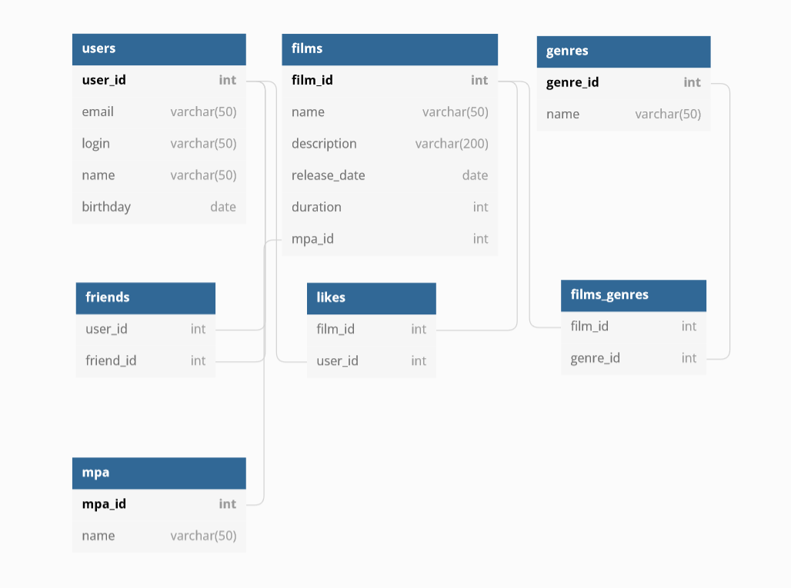

# java-filmorate
### Структура базы данных

### Основные запросы
- Выборка всех фильмов
~~~~sql
SELECT * FROM films
~~~~
- Выборка одного фильма с id 1
~~~~sql
SELECT * FROM films WHERE id = 1
~~~~
- Выборка всех пользователей
~~~~sql
SELECT * FROM users
~~~~
- Выборка одного пользователя с id = 1;
~~~~sql
SELECT * FROM users WHERE id = 1
~~~~